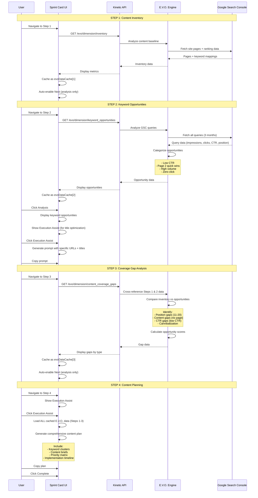
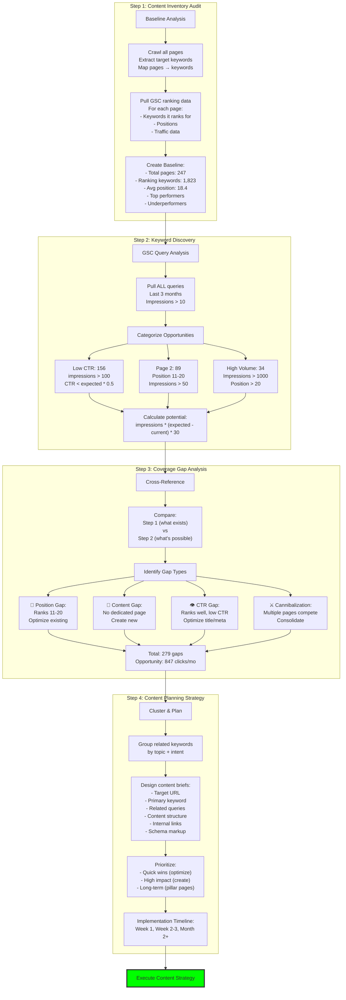
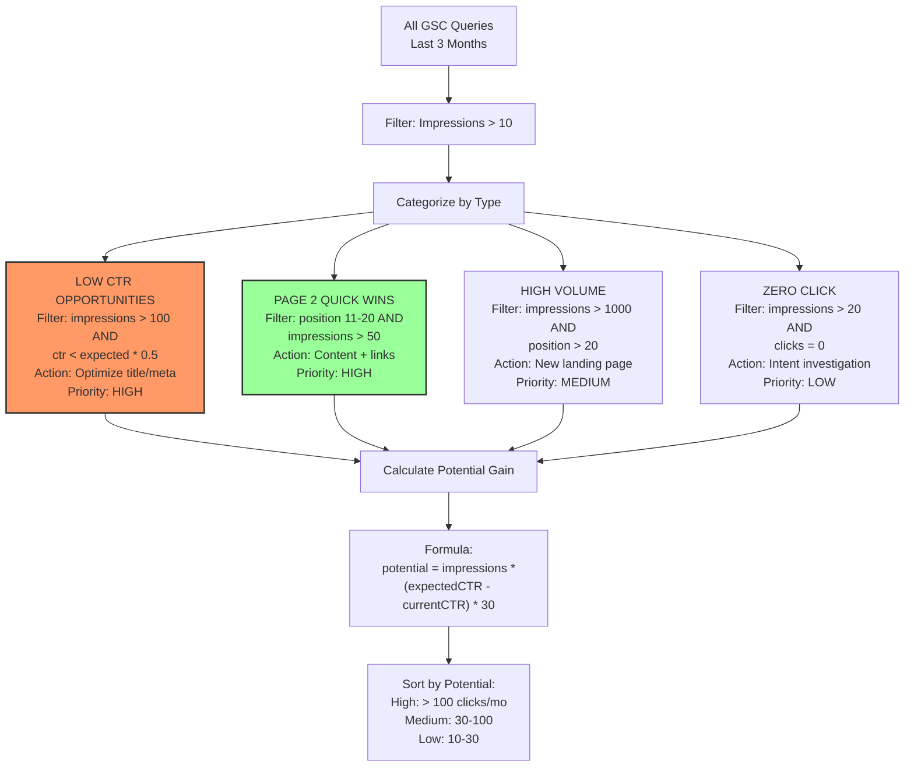
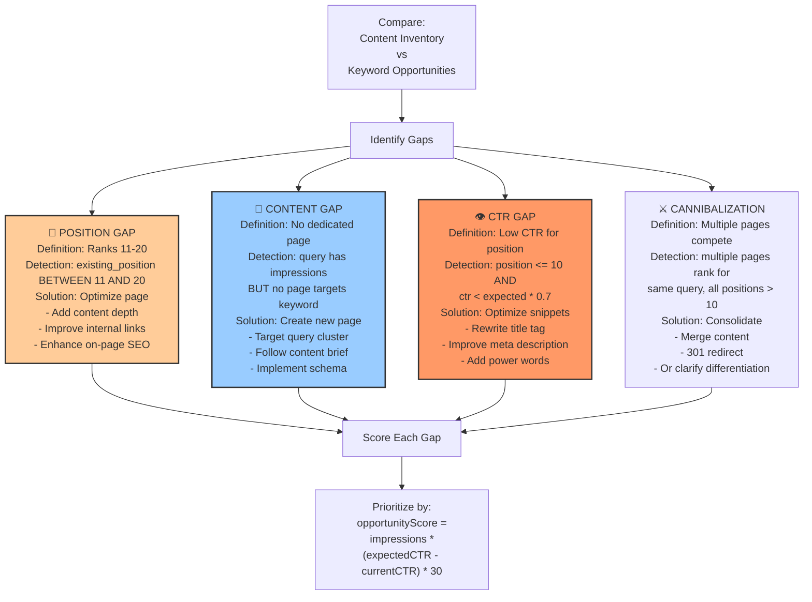
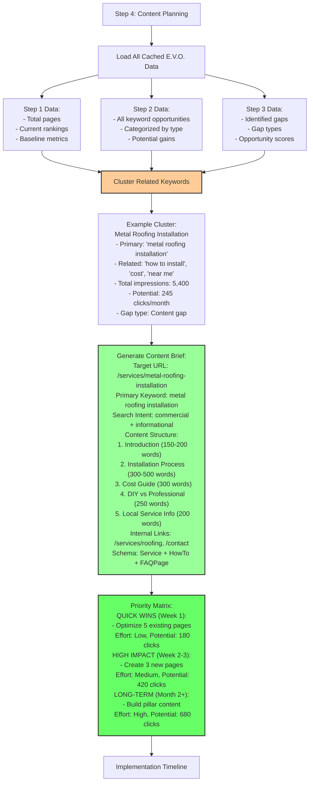
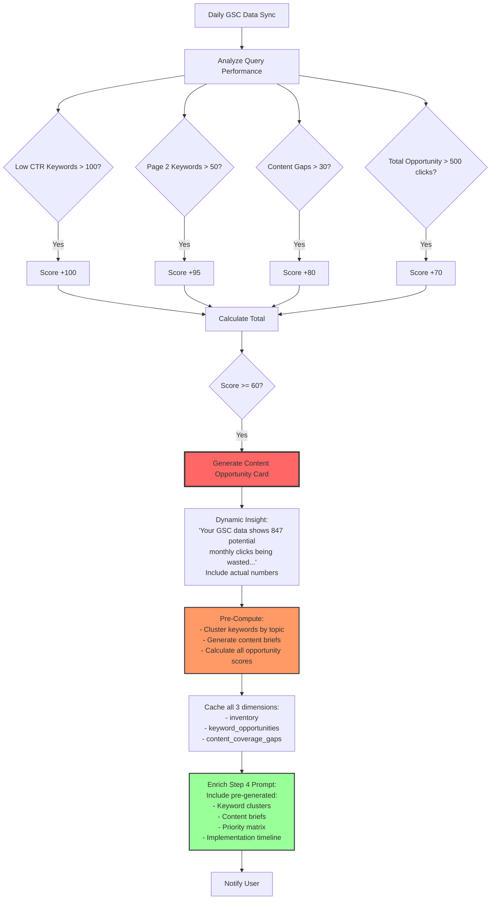
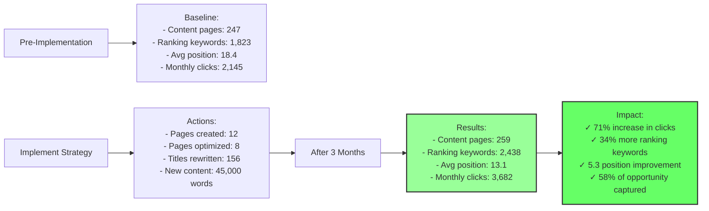

# Content Opportunity Protocol - Flow Diagram

## Protocol Overview
**Type**: Analysis-Based (E.V.O. Integrated + GSC-Driven)
**Sprint Circle**: 3 (Growth)
**E.V.O. Dimensions**: inventory, keyword_opportunities, content_coverage_gaps

## Complete Flow with Sequential E.V.O. Analysis

```mermaid
graph TD
    Start[User Clicks Sprint Circle 3] --> LoadCard[Load Content Opportunity Card]
    
    LoadCard --> Page1[Page 1: Strategist Insight]
    Page1 --> P1Content["'Google is already showing your site...'<br/>Impression opportunities"]
    P1Content --> Continue[User Clicks Continue]
    
    Continue --> Page2[Page 2: Step 1 - Content Inventory]
    
    Page2 --> AutoFetch1["Auto-Fetch: inventory dimension"]
    AutoFetch1 --> ShowLoading1[Analysis Button: Loading]
    ShowLoading1 --> FetchComplete1[Analysis Button: Ready]
    
    FetchComplete1 --> UserAnalysis1[User Clicks Analysis]
    UserAnalysis1 --> Modal1["Display Inventory:<br/>- Total pages: 247<br/>- Ranking keywords: 1,823<br/>- Avg position: 18.4<br/>- Content coverage: 62%"]
    
    Modal1 --> NoExecNeeded1[No Execution Assist Needed]
    NoExecNeeded1 --> AutoEnable1[Auto-Enable Next Step]
    
    AutoEnable1 --> NextClick1[User Clicks Next]
    NextClick1 --> Page3[Page 3: Step 2 - Keyword Discovery]
    
    Page3 --> AutoFetch2["Auto-Fetch: keyword_opportunities"]
    AutoFetch2 --> ShowLoading2[Analysis Button: Loading]
    ShowLoading2 --> FetchComplete2[Analysis Button: Ready]
    
    FetchComplete2 --> UserAnalysis2[User Clicks Analysis]
    UserAnalysis2 --> Modal2["Display Opportunities:<br/>- Low CTR: 156 keywords<br/>- Page 2 wins: 89 keywords<br/>- High volume: 34 keywords<br/>- Potential gain: 847 clicks/mo"]
    
    Modal2 --> CheckOpportunities{Has Opportunities?}
    
    CheckOpportunities -->|Yes| ShowExec2[Show Execution Assist]
    ShowExec2 --> UserClicksExec2[User Clicks Execution Assist]
    
    UserClicksExec2 --> SpecialPrompt["Generate Keyword Optimization Prompt<br/>WITH DATA:<br/>1. 'roof repair near me'<br/>   Page: /roof-repair<br/>   Position: 4, CTR: 2.1% (Expected: 13%)<br/>   Potential: +45 clicks/month<br/>2. 'metal roofing cost'<br/>   Page: /metal-roofing<br/>   Position: 6, CTR: 1.8% (Expected: 8%)<br/>   Potential: +67 clicks/month"]
    
    SpecialPrompt --> UserCopies2[User Copies Title Optimization Prompt]
    UserCopies2 --> NextClick2[User Clicks Next]
    
    NextClick2 --> Page4[Page 4: Step 3 - Coverage Gap Analysis]
    
    Page4 --> AutoFetch3["Auto-Fetch: content_coverage_gaps"]
    AutoFetch3 --> ShowLoading3[Analysis Button: Loading]
    ShowLoading3 --> FetchComplete3[Analysis Button: Ready]
    
    FetchComplete3 --> UserAnalysis3[User Clicks Analysis]
    UserAnalysis3 --> Modal3["Display Gaps:<br/>- Position gaps: 89 (11-20)<br/>- Content gaps: 34 (no page)<br/>- CTR gaps: 156 (low CTR)<br/>- Total opportunity: 847 clicks/mo"]
    
    Modal3 --> GapCategories["Show by Type:<br/>📍 Position gap: optimize existing<br/>📄 Content gap: create new page<br/>👁️ CTR gap: optimize meta<br/>⚔️ Cannibalization: consolidate"]
    
    GapCategories --> NoExecNeeded3[No Execution Assist Needed]
    NoExecNeeded3 --> AutoEnable3[Auto-Enable Next Step]
    
    AutoEnable3 --> NextClick3[User Clicks Next]
    NextClick3 --> Page5[Page 5: Step 4 - Content Planning]
    
    Page5 --> ShowExec4[Show Execution Assist]
    ShowExec4 --> UserClicksExec4[User Clicks Execution Assist]
    
    UserClicksExec4 --> LoadAllData["Load Cached Data:<br/>- Step 1: Content inventory<br/>- Step 2: Keyword opportunities<br/>- Step 3: Coverage gaps"]
    
    LoadAllData --> GenContentPlan[Generate Content Planning Prompt]
    
    GenContentPlan --> ComprehensivePlan["COMPREHENSIVE PLAN:<br/>1. Opportunity Summary<br/>   - 279 total gaps<br/>   - 847 potential clicks/month<br/>2. Keyword Clusters<br/>   - Metal Roofing (245 clicks)<br/>   - Roof Repair (189 clicks)<br/>3. Content Briefs<br/>   - Target URL<br/>   - Primary keyword<br/>   - Related queries<br/>   - Content structure<br/>   - Internal links<br/>   - Schema markup<br/>4. Priority Matrix<br/>   - Quick wins (Week 1)<br/>   - High impact (Week 2-3)<br/>   - Long-term (Month 2+)"]
    
    ComprehensivePlan --> UserCopies4[User Copies Plan]
    UserCopies4 --> EnableComplete[Complete Button: ENABLED]
    
    EnableComplete --> CompleteClick[User Clicks Complete]
    CompleteClick --> Page6[Page 6: Completion]
    
    Page6 --> Status1["Analyzing Coverage Gaps..."]
    Status1 -->|2s| Status2["Content Strategy Complete"]
    Status2 -->|2s| Status3["Opportunity pages identified"]
    
    Status3 --> SaveDB[Save Completion]
    SaveDB --> UnlockNext[All Circles Complete!]
    UnlockNext --> CloseCard[Close Card]
    
    style Page2 fill:#9cf,stroke:#333,stroke-width:2px
    style Page3 fill:#9cf,stroke:#333,stroke-width:2px
    style Page4 fill:#9cf,stroke:#333,stroke-width:2px
    style Page5 fill:#bbf,stroke:#333,stroke-width:2px
    style SpecialPrompt fill:#f96,stroke:#333,stroke-width:2px
    style GenContentPlan fill:#9f9,stroke:#333,stroke-width:2px
```

## Sequential E.V.O. Data Flow

## Four-Step GSC Analysis Strategy

## Keyword Opportunity Categorization

## Gap Type Identification

## Content Planning with Data from All Steps

## Special Step 2 Keyword Optimization Prompt

```mermaid
graph TD
    Step2Analysis[Step 2: Keyword Discovery Analysis] --> HasOpportunities{Has Low CTR Keywords?}
    
    HasOpportunities -->|Yes| ShowExecButton[Show Execution Assist]
    ShowExecButton --> UserClicks[User Clicks Execution Assist]
    
    UserClicks --> PullData[Pull Opportunity Data from E.V.O.]
    
    PullData --> BuildPrompt["Build Special Prompt:<br/>OBJECTIVE: Optimize titles and metas<br/>to improve CTR"]
    
    BuildPrompt --> IncludeKeywords["For Each Keyword:<br/>1. Query: 'roof repair near me'<br/>   Page: /roof-repair<br/>   Position: 4<br/>   Current CTR: 2.1%<br/>   Expected CTR: 13%<br/>   Potential: +45 clicks/month<br/>2. Query: 'metal roofing cost'<br/>   Page: /metal-roofing<br/>   Position: 6<br/>   Current CTR: 1.8%<br/>   Expected CTR: 8%<br/>   Potential: +67 clicks/month"]
    
    IncludeKeywords --> Instructions["INSTRUCTIONS:<br/>1. For each page:<br/>   - Locate HTML/template<br/>   - Find current title + meta<br/>   - Read page content<br/>2. Optimize title:<br/>   - Include keyword naturally<br/>   - Under 60 characters<br/>   - Compelling + click-worthy<br/>3. Optimize meta description:<br/>   - Include keyword<br/>   - Under 155 characters<br/>   - Include benefits + CTA<br/>4. Create optimization plan"]
    
    Instructions --> UserCopies[User Copies Prompt]
    UserCopies --> EnableNext[Enable Next Step]
    
    style BuildPrompt fill:#f96,stroke:#333,stroke-width:2px
    style IncludeKeywords fill:#9f9,stroke:#333,stroke-width:2px
```

## Future E.V.O. Auto-Generation

## Success Metrics & Tracking

