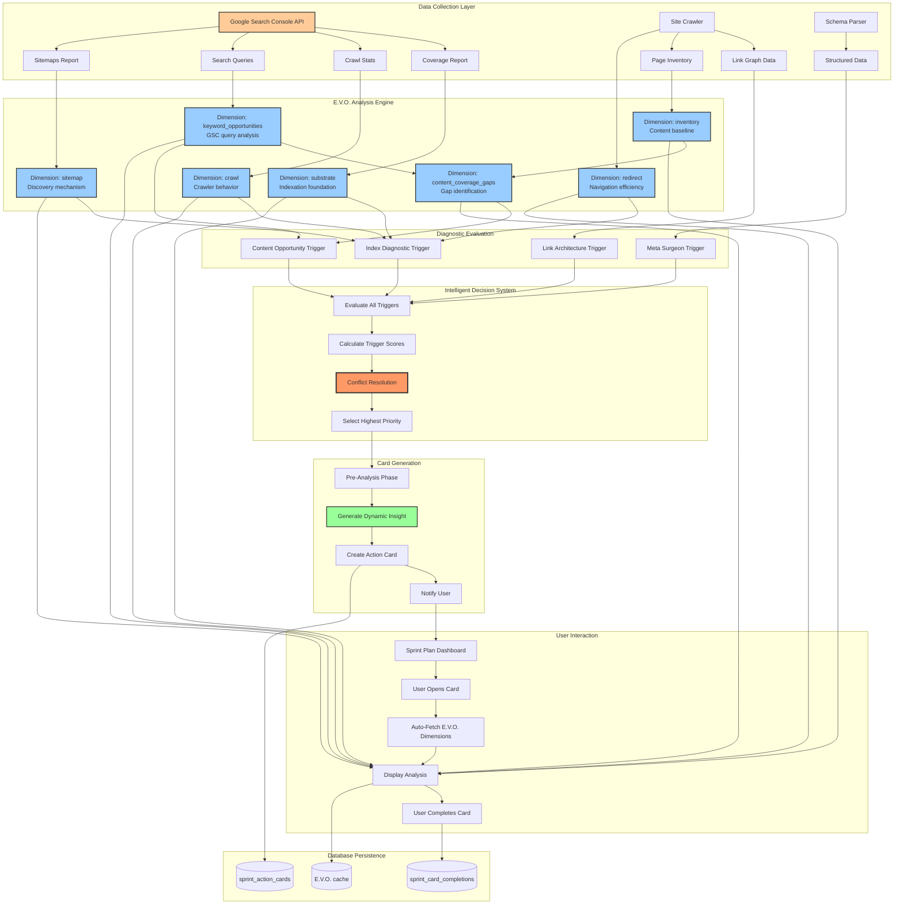
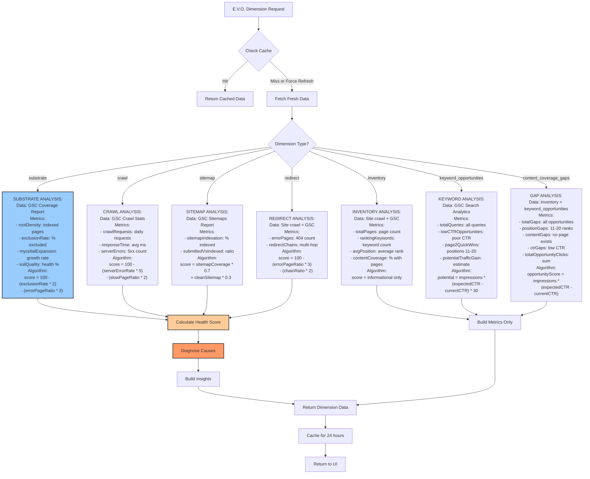
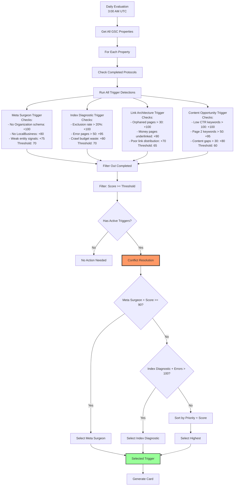
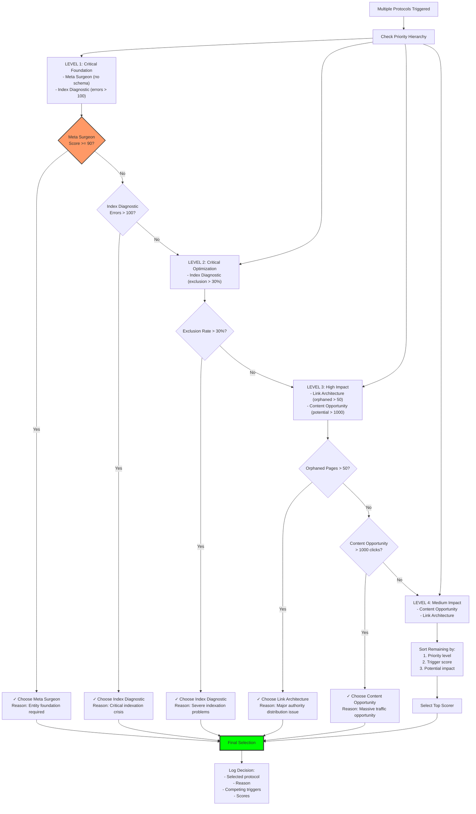
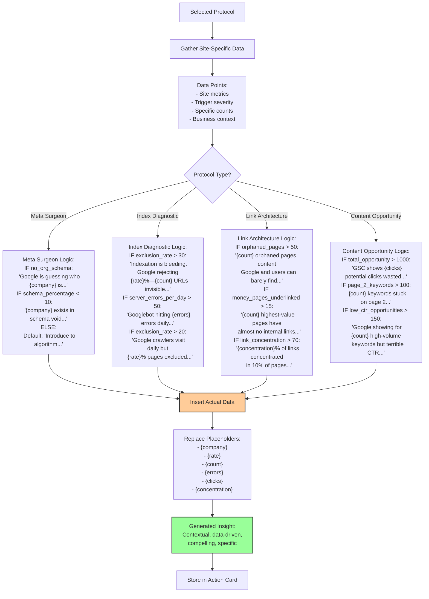
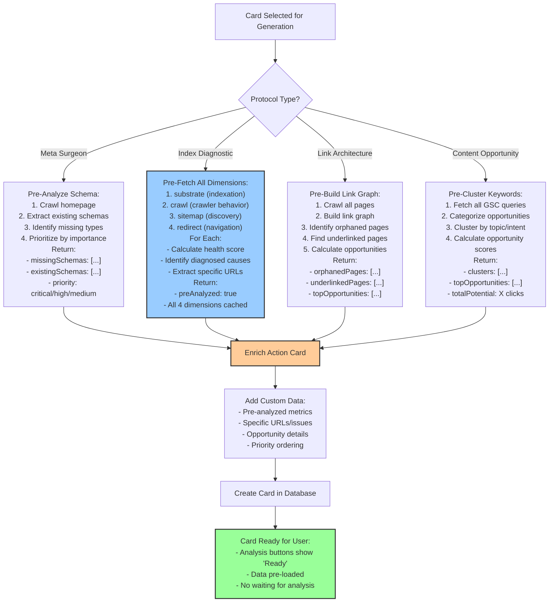
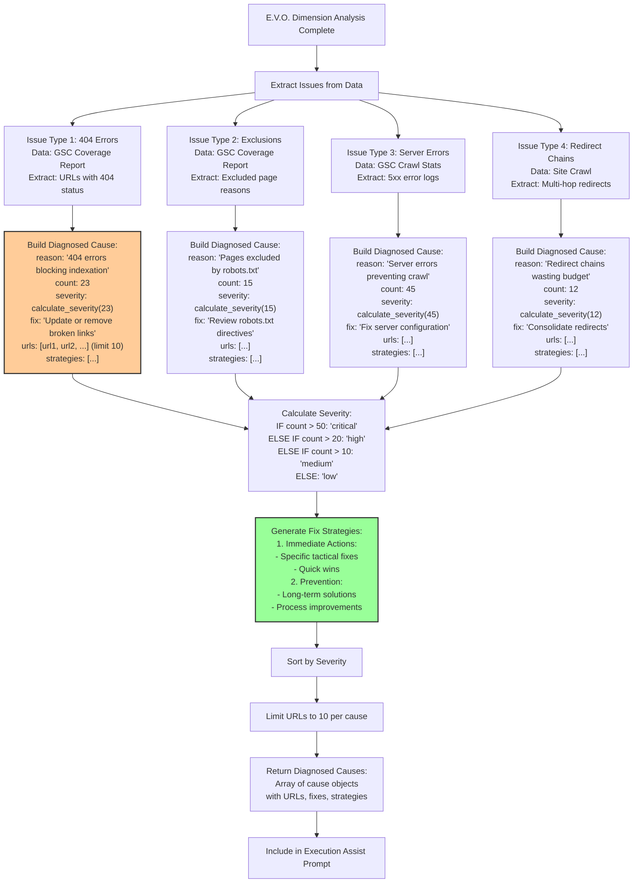
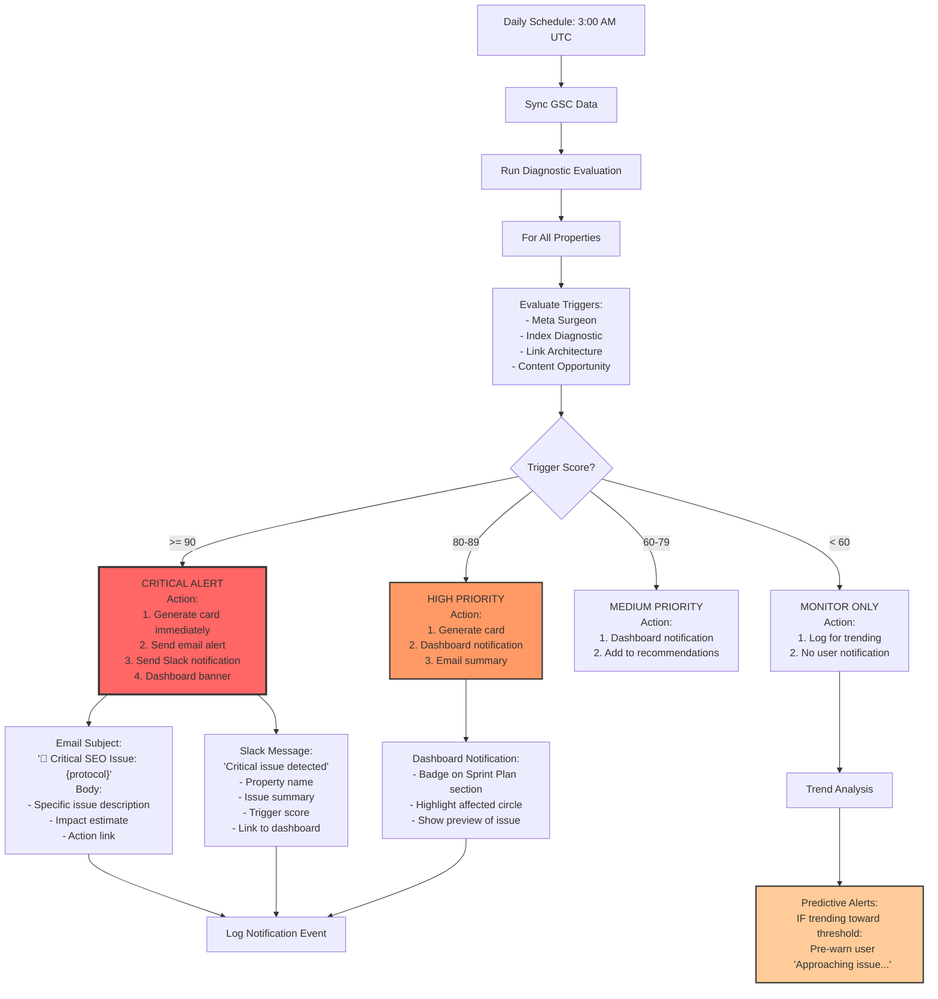
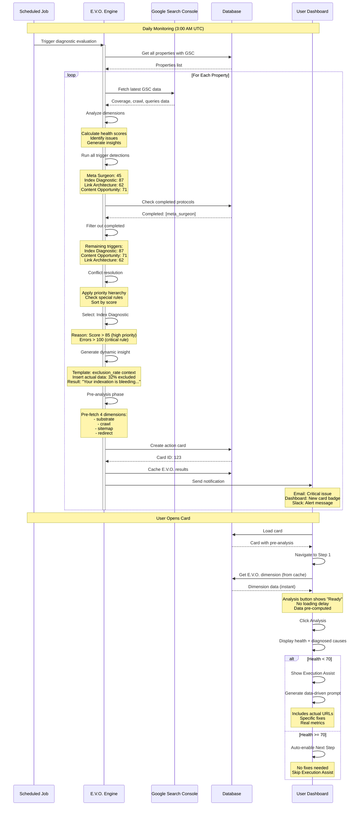

# E.V.O. Intelligence System - AI Decision-Making Architecture

## System Overview

E.V.O. (Evolving Optimization) is the AI analysis engine that continuously monitors Google Search Console data, detects optimization opportunities, and procedurally generates Sprint Plan Action Cards with customized insights and data-driven recommendations.

## Complete E.V.O. System Architecture

## E.V.O. Dimension Analysis System

## Intelligent Trigger Detection & Scoring

## Priority Hierarchy & Conflict Resolution

## Dynamic Insight Generation Intelligence

## Pre-Analysis Phase Intelligence

## Diagnosed Cause Generation Algorithm

## Monitoring & Alert System

## Complete E.V.O. Intelligence Flow

## Key Intelligence Capabilities

### 1. Adaptive Trigger Detection
- Monitors multiple data sources simultaneously
- Calculates weighted scores based on severity and count
- Dynamically adjusts thresholds based on site characteristics

### 2. Intelligent Conflict Resolution
- Hierarchical priority system (foundation > optimization > growth)
- Special rules for critical issues (errors > 100, no schema)
- Considers completed protocols to avoid duplication

### 3. Context-Aware Insight Generation
- Analyzes site-specific metrics
- Selects appropriate insight template
- Injects actual data for compelling narrative

### 4. Predictive Pre-Analysis
- Pre-computes dimension data before user opens card
- Caches results for instant display
- Reduces user wait time from minutes to seconds

### 5. Data-Driven Recommendations
- Extracts specific URLs with issues
- Generates actionable fix strategies
- Prioritizes by impact and effort

### 6. Continuous Learning
- Tracks completion rates and success metrics
- Adjusts trigger thresholds based on outcomes
- Improves insight generation from user feedback
