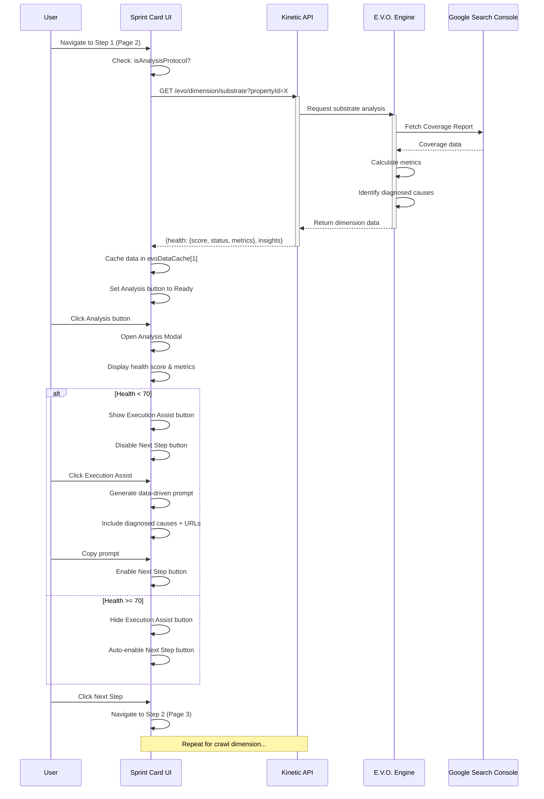
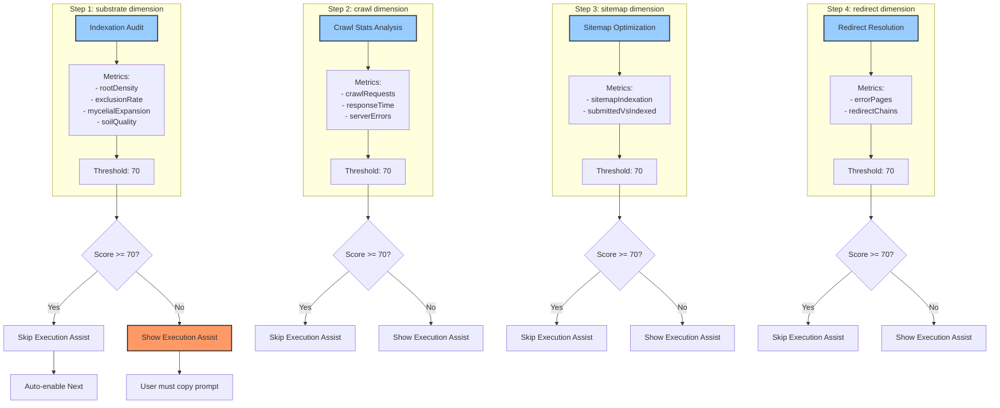
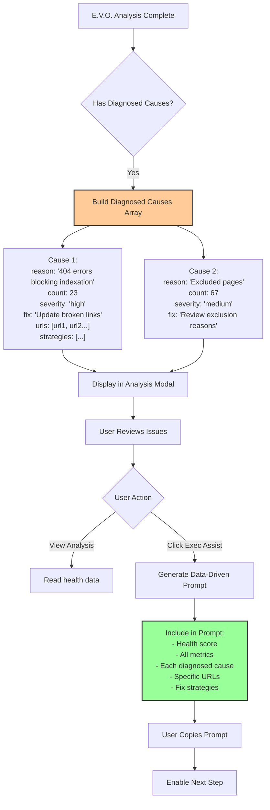
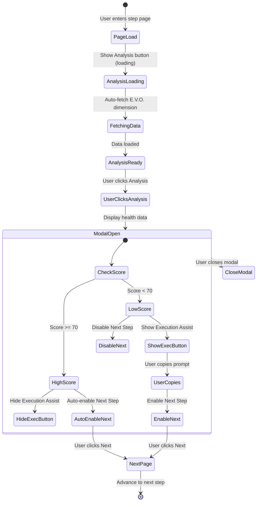
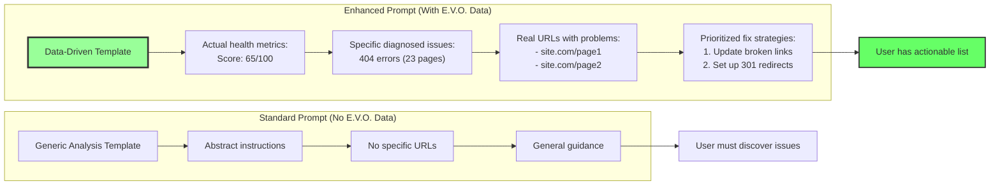
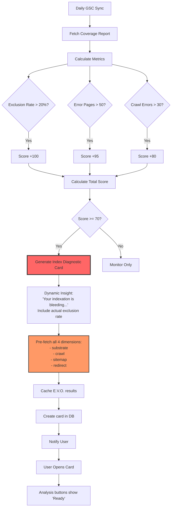

# Index Diagnostic Protocol - Flow Diagram

## Protocol Overview
**Type**: Analysis-Based (E.V.O. Integrated)
**Sprint Circle**: 1 (Foundation)
**E.V.O. Dimensions**: substrate, crawl, sitemap, redirect

## Complete Flow with E.V.O. Integration

```mermaid
graph TD
    Start[User Clicks Sprint Circle 1] --> LoadCard[Load Index Diagnostic Card]
    
    LoadCard --> Page1[Page 1: Strategist Insight]
    Page1 --> P1Content["'Google's crawlers visit daily...'<br/>Focus on crawl budget"]
    P1Content --> Continue[User Clicks Continue]
    
    Continue --> Page2[Page 2: Step 1 - Indexation Audit]
    
    Page2 --> AutoFetch[Auto-Fetch E.V.O. Dimension]
    AutoFetch --> FetchSubstrate["API: GET /evo/dimension/substrate<br/>propertyId, forceRefresh"]
    
    FetchSubstrate --> ShowLoading[Analysis Button: Loading]
    ShowLoading --> Poll{Poll Every 2s}
    Poll -->|In Progress| UpdateProgress["Show: 'Analyzing substrate...'"]
    UpdateProgress --> Poll
    
    Poll -->|Complete| CacheData[Cache E.V.O. Data]
    CacheData --> AnalysisReady[Analysis Button: Ready]
    
    AnalysisReady --> UserClicksAnalysis[User Clicks Analysis]
    UserClicksAnalysis --> ShowModal[Open Analysis Modal]
    
    ShowModal --> DisplayHealth["Health Score: 65/100<br/>Status: Needs Attention"]
    DisplayHealth --> DisplayMetrics["Metrics:<br/>- Root Density: 450<br/>- Exclusion Rate: 15%<br/>- Error Pages: 23"]
    DisplayMetrics --> DisplayDiagnosed["Diagnosed Causes:<br/>1. 404 errors (23 pages)<br/>   Fix: Update broken links<br/>   URLs: [url1, url2...]<br/>2. Exclusion issues (67 pages)"]
    
    DisplayDiagnosed --> CheckHealth{Health >= 70?}
    
    CheckHealth -->|No| ShowExecAssist[Show Execution Assist]
    CheckHealth -->|Yes| HideExecAssist[Hide Execution Assist]
    CheckHealth -->|Yes| AutoEnable[Auto-Enable Next Step]
    
    ShowExecAssist --> NextDisabled[Next Step: DISABLED]
    NextDisabled --> UserClicksExec[User Clicks Execution Assist]
    
    UserClicksExec --> GenDataDriven[Generate Data-Driven Prompt]
    GenDataDriven --> PromptWithURLs["CURRENT SITE HEALTH:<br/>Score: 65/100<br/>KEY METRICS: [actual data]<br/>DIAGNOSED ISSUES:<br/>1. 404 errors (23 pages)<br/>   Affected URLs: [real URLs]<br/>   Fix: Update broken links<br/>DELIVERABLE: indexation-audit-report.md"]
    
    PromptWithURLs --> UserCopies[User Copies Prompt]
    UserCopies --> EnableNext[Next Step: ENABLED]
    
    EnableNext --> NextClick[User Clicks Next Step]
    AutoEnable --> NextClick
    
    NextClick --> Page3[Page 3: Step 2 - Crawl Stats]
    
    Page3 --> FetchCrawl["Auto-Fetch: crawl dimension"]
    FetchCrawl --> Step2Flow["Similar flow:<br/>- Show Analysis<br/>- Check health<br/>- Show/Hide Exec Assist"]
    
    Step2Flow --> Page4[Page 4: Step 3 - Sitemap]
    Page4 --> FetchSitemap["Auto-Fetch: sitemap dimension"]
    FetchSitemap --> Step3Flow["Similar flow"]
    
    Step3Flow --> Page5[Page 5: Step 4 - Redirects]
    Page5 --> FetchRedirect["Auto-Fetch: redirect dimension"]
    FetchRedirect --> Step4Flow["Similar flow"]
    
    Step4Flow --> CompleteClick[User Clicks Complete]
    CompleteClick --> Page6[Page 6: Completion]
    
    Page6 --> Status1["Analyzing GSC Coverage Data..."]
    Status1 -->|2s| Status2["Crawl Budget Optimized"]
    Status2 -->|2s| Status3["High-value pages prioritized"]
    
    Status3 --> SaveDB["Save to sprint_card_completions"]
    SaveDB --> UnlockCircle2[Unlock Circle 2]
    UnlockCircle2 --> CloseCard[Close Card]
    
    style Page2 fill:#bbf,stroke:#333,stroke-width:2px
    style AutoFetch fill:#f96,stroke:#333,stroke-width:3px
    style ShowModal fill:#fc9,stroke:#333,stroke-width:2px
    style GenDataDriven fill:#9f9,stroke:#333,stroke-width:2px
```



## E.V.O. Dimension Analysis Flow



## E.V.O. Dimension Mapping



## Diagnosed Cause Structure



## Button State Logic



## Data-Driven Prompt Enhancement



## Future E.V.O. Auto-Generation Trigger



## Complete E.V.O. Cache Structure

```javascript
// E.V.O. Data Cache
evoDataCache = {
  1: {  // Step 1 (substrate)
    dimensionData: {
      health: {
        score: 65,
        status: "warning",
        metrics: {
          rootDensity: 450,
          exclusionRate: 15,
          mycelialExpansion: 2.3,
          soilQuality: 82
        },
        insights: [
          {
            category: "exclusions",
            message: "15% exclusion rate",
            diagnosedCauses: [
              {
                reason: "404 errors",
                count: 23,
                severity: "high",
                fix: "Update broken links",
                urls: ["url1", "url2"],
                strategies: [...]
              }
            ]
          }
        ]
      }
    },
    needsFixes: true,
    healthScore: 65,
    healthThreshold: 70
  },
  2: { /* Step 2 (crawl) */ },
  3: { /* Step 3 (sitemap) */ },
  4: { /* Step 4 (redirect) */ }
}
```
