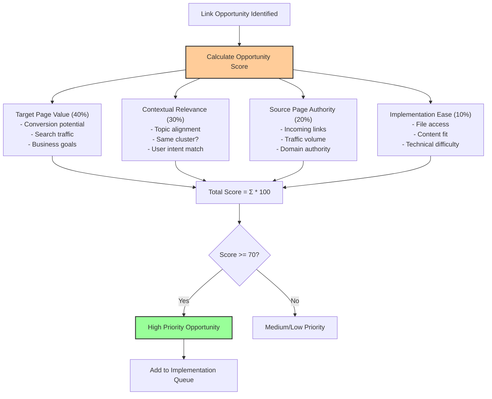
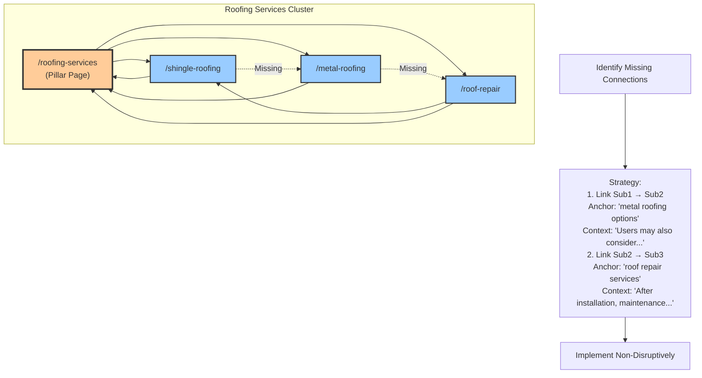
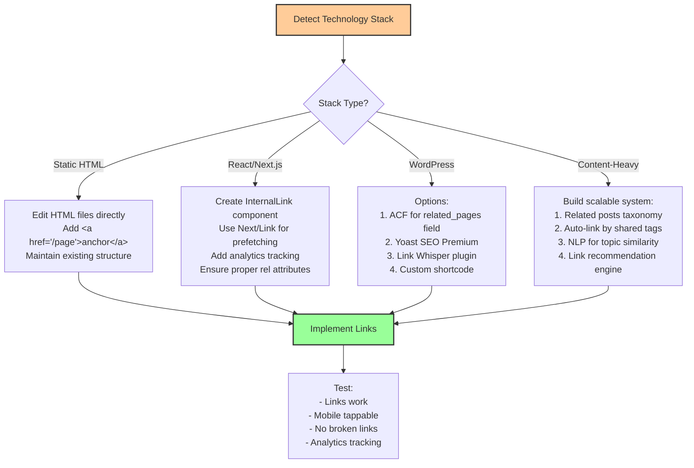
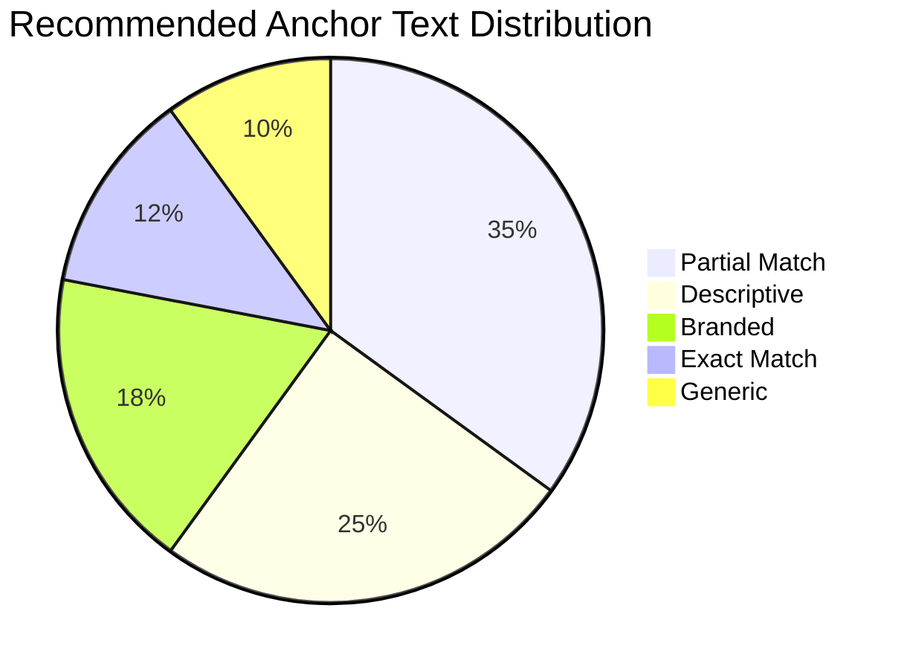
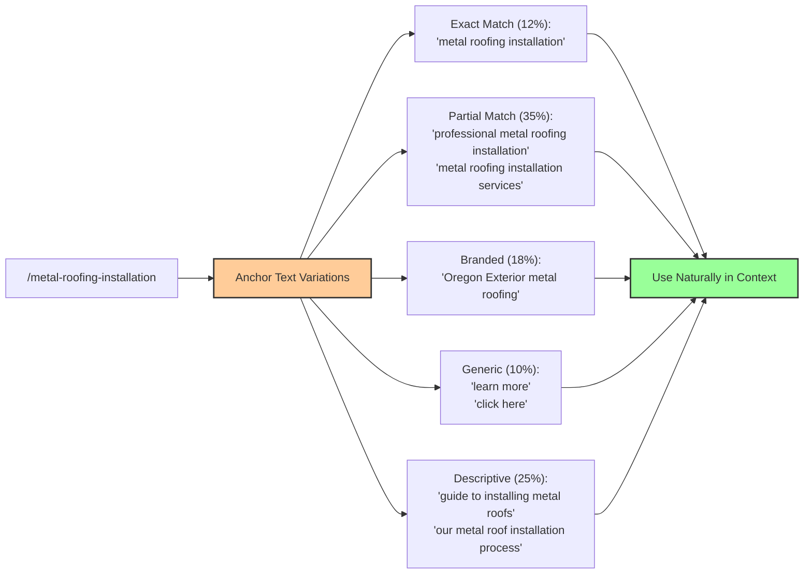
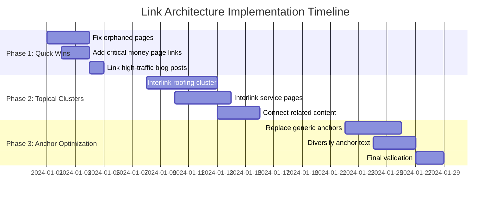
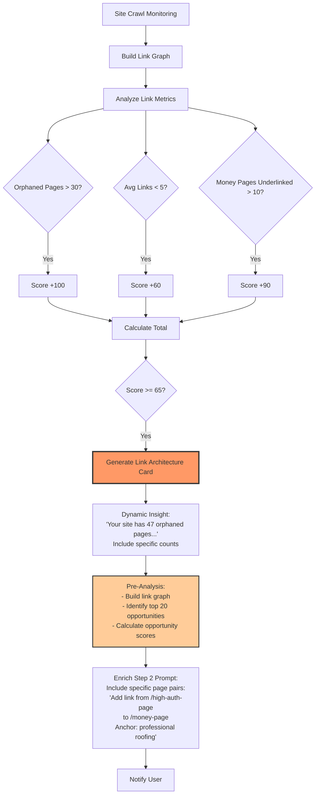
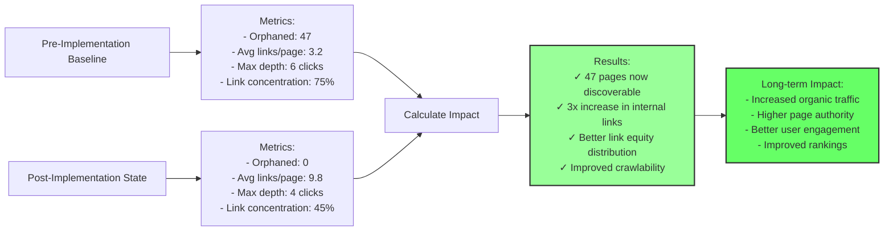

# Link Architecture Protocol - Flow Diagram

## Protocol Overview
**Type**: Link Expansion (Hybrid: Analysis + Implementation)
**Sprint Circle**: 2 (Optimization)
**E.V.O. Integration**: None (Manual analysis protocol)

## Complete Flow

```mermaid
graph TD
    Start[User Clicks Sprint Circle 2] --> LoadCard[Load Link Architecture Card]
    
    LoadCard --> Page1[Page 1: Strategist Insight]
    Page1 --> P1Content["'Internal links distribute authority...'<br/>Orphaned pages, weak signals"]
    P1Content --> Continue[User Clicks Continue]
    
    Continue --> Page2[Page 2: Step 1 - Link Inventory]
    
    Page2 --> NoEVO[No E.V.O. Auto-Fetch]
    NoEVO --> ShowExec[Show Execution Assist]
    ShowExec --> NextDisabled[Next Step: DISABLED]
    
    NextDisabled --> UserClicksExec[User Clicks Execution Assist]
    UserClicksExec --> DetectLinkProtocol{Protocol = link_expansion?}
    
    DetectLinkProtocol -->|Yes| GenLinkPrompt[Generate Link Expansion Prompt]
    
    GenLinkPrompt --> Step1Prompt["OBJECTIVE: Crawl and analyze all internal links<br/>INSTRUCTIONS:<br/>- Map all internal links<br/>- Identify orphaned pages<br/>- Calculate link depth<br/>- Analyze link equity distribution<br/>TOOLS: Screaming Frog, Sitebulb, custom script<br/>DELIVERABLE: link-inventory-audit.md"]
    
    Step1Prompt --> Modal[Display Modal]
    Modal --> UserCopies[User Copies Prompt]
    UserCopies --> EnableNext[Next Step: ENABLED]
    
    EnableNext --> NextClick[User Clicks Next Step]
    NextClick --> Page3[Page 3: Step 2 - Strategic Opportunities]
    
    Page3 --> Step2Exec[Show Execution Assist]
    Step2Exec --> Step2Prompt["OBJECTIVE: Identify pages needing authority<br/>INSTRUCTIONS:<br/>- Identify target pages (money pages)<br/>- Find contextual source pages<br/>- Score opportunities by impact<br/>- Map topical clusters<br/>DELIVERABLE: strategic-link-opportunities.md"]
    
    Step2Prompt --> UserCopies2[User Copies]
    UserCopies2 --> Page4[Page 4: Step 3 - Anchor Optimization]
    
    Page4 --> Step3Exec[Show Execution Assist]
    Step3Exec --> Step3Prompt["OBJECTIVE: Optimize anchor text patterns<br/>INSTRUCTIONS:<br/>- Audit current anchor text<br/>- Identify over-optimization<br/>- Design diverse anchor variations<br/>- Plan natural language anchors<br/>DELIVERABLE: anchor-text-optimization-plan.md"]
    
    Step3Prompt --> UserCopies3[User Copies]
    UserCopies3 --> Page5[Page 5: Step 4 - Implementation]
    
    Page5 --> Step4Exec[Show Execution Assist]
    Step4Exec --> Step4Prompt["OBJECTIVE: Create implementation roadmap<br/>INSTRUCTIONS:<br/>- Identify exact placement locations<br/>- Specify file modifications<br/>- Ensure non-disruptive integration<br/>- Plan scalable linking patterns<br/>DELIVERABLE: link-implementation-path.md"]
    
    Step4Prompt --> UserCopies4[User Copies]
    UserCopies4 --> EnableComplete[Complete Button: ENABLED]
    
    EnableComplete --> CompleteClick[User Clicks Complete]
    CompleteClick --> Page6[Page 6: Completion]
    
    Page6 --> Status1["Analyzing Link Architecture..."]
    Status1 -->|2s| Status2["Link Distribution Strategy Complete"]
    Status2 -->|2s| Status3["Strategic pathways established"]
    
    Status3 --> SaveDB[Save Completion]
    SaveDB --> UnlockCircle3[Unlock Circle 3]
    UnlockCircle3 --> CloseCard[Close Card]
    
    style Page2 fill:#bbf,stroke:#333,stroke-width:2px
    style Page3 fill:#bbf,stroke:#333,stroke-width:2px
    style Page4 fill:#bbf,stroke:#333,stroke-width:2px
    style Page5 fill:#bbf,stroke:#333,stroke-width:2px
    style GenLinkPrompt fill:#f96,stroke:#333,stroke-width:2px
```



## Four-Step Link Strategy

```mermaid
graph TD
    subgraph "Step 1: Link Inventory Audit"
        S1[Crawl Site Structure]
        S1 --> S1A[Map All Internal Links]
        S1A --> S1B[Calculate Link Metrics]
        S1B --> S1C["Identify:<br/>- Orphaned pages (0 incoming)<br/>- Link depth from homepage<br/>- Link equity distribution<br/>- Hub pages"]
    end
    
    subgraph "Step 2: Strategic Opportunities"
        S2[Identify Target Pages]
        S2 --> S2A["Money pages needing links<br/>Orphaned valuable content<br/>Topical pillar pages"]
        S2A --> S2B[Find Source Pages]
        S2B --> S2C["High-authority pages<br/>High-traffic pages<br/>Contextually relevant pages"]
        S2C --> S2D["Score Opportunities:<br/>targetValue * 0.4<br/>+ relevance * 0.3<br/>+ sourceAuth * 0.2<br/>+ ease * 0.1"]
    end
    
    subgraph "Step 3: Anchor Text Optimization"
        S3[Audit Current Anchors]
        S3 --> S3A["Check distribution:<br/>- Exact match: 10-15%<br/>- Partial match: 30-40%<br/>- Branded: 15-20%<br/>- Generic: 10-15%<br/>- Descriptive: 20-30%"]
        S3A --> S3B[Design Anchor Variations]
        S3B --> S3C["Create diverse anchors<br/>Avoid over-optimization<br/>Natural language flow"]
    end
    
    subgraph "Step 4: Implementation Path"
        S4[Plan Placement Zones]
        S4 --> S4A["High value:<br/>- Main content body<br/>- Contextual mentions"]
        S4A --> S4B["Medium value:<br/>- Related resources<br/>- End-of-content sections"]
        S4B --> S4C[Create Implementation Roadmap]
        S4C --> S4D["Phase 1: Quick wins<br/>Phase 2: Topical clusters<br/>Phase 3: Anchor optimization"]
    end
    
    S1C --> S2
    S2D --> S3
    S3C --> S4
    S4D --> Complete[Link Architecture Complete]
    
    style Complete fill:#0f0,stroke:#333,stroke-width:3px
```



## Link Opportunity Scoring System



## Topical Cluster Linking



## Non-Disruptive Implementation Rules

```mermaid
graph TD
    Implementation[Implementation Planning] --> Rules{Check Rules}
    
    Rules --> Rule1[Max 3-5 new links per page]
    Rules --> Rule2[Natural sentence structure]
    Rules --> Rule3[No conversion content interruption]
    Rules --> Rule4[Link density < 5%]
    Rules --> Rule5[Mobile tappable (48px min)]
    
    Rule1 --> Validate{All Rules Pass?}
    Rule2 --> Validate
    Rule3 --> Validate
    Rule4 --> Validate
    Rule5 --> Validate
    
    Validate -->|Yes| PlacementZones[Choose Placement Zone]
    Validate -->|No| Reject[Reject or Adjust Plan]
    
    PlacementZones --> Zone1["High Value:<br/>- First 2 paragraphs<br/>- Contextual mentions<br/>- Problem → solution sections"]
    
    PlacementZones --> Zone2["Medium Value:<br/>- Related resources sidebar<br/>- End-of-content sections<br/>- Author bio"]
    
    PlacementZones --> Zone3["Low Value (Avoid):<br/>- Footer navigation<br/>- Header menu<br/>- Sidebar nav"]
    
    Zone1 --> Priority[High Priority Implementation]
    Zone2 --> Priority
    
    style Validate fill:#fc9,stroke:#333,stroke-width:2px
    style Priority fill:#9f9,stroke:#333,stroke-width:2px
```

## Technology-Specific Implementation



## Anchor Text Distribution Strategy





## Implementation Roadmap Template



## Future E.V.O. Auto-Generation



## Success Metrics Tracking


