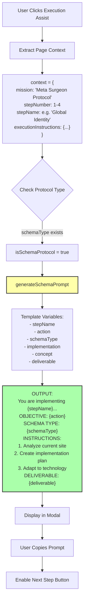
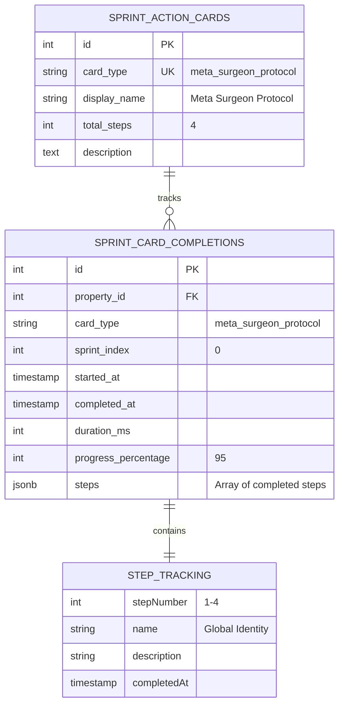
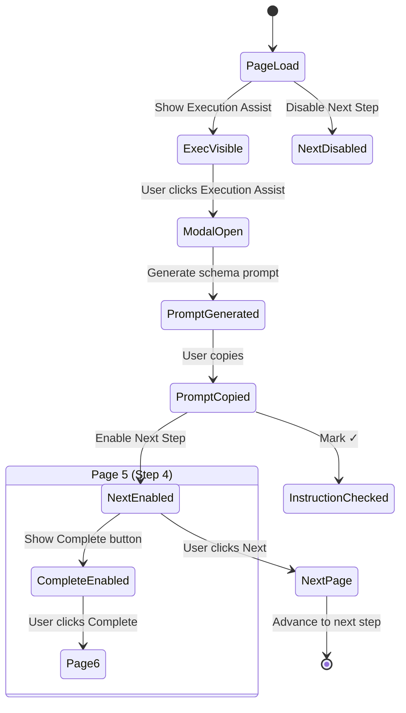
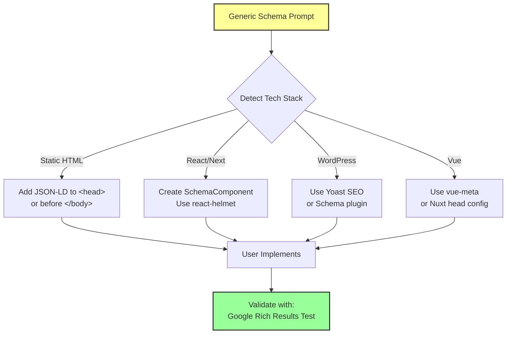
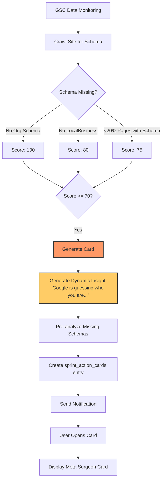

# Meta Surgeon Protocol - Flow Diagram

## Protocol Overview
**Type**: Schema Implementation (Manual)
**Sprint Circle**: 0 (Foundation)
**E.V.O. Integration**: None (Manual protocol)

## Complete Flow

```mermaid
graph TD
    Start[User Clicks Sprint Circle 0] --> LoadCard[Load Meta Surgeon Card]
    
    LoadCard --> Page1[Page 1: Strategist Insight]
    Page1 --> P1Content["'Before we fight for keywords...'<br/>{{COMPANY_NAME}} placeholder"]
    P1Content --> Continue[User Clicks Continue]
    
    Continue --> Page2[Page 2: Step 1 - Global Identity]
    
    Page2 --> P2Structure{Protocol Type Check}
    P2Structure -->|Schema Protocol| HideAnalysis[Hide Analysis Button]
    HideAnalysis --> ShowExec2[Show Execution Assist]
    ShowExec2 --> DisableNext2[Next Step: DISABLED]
    
    DisableNext2 --> UserExec2[User Clicks Execution Assist]
    UserExec2 --> DetectType2[Detect: schemaType exists]
    DetectType2 --> GenSchema2[Generate Schema Prompt]
    
    GenSchema2 --> PromptContent2["OBJECTIVE: Add Organization schema<br/>SCHEMA TYPE: Organization<br/>INSTRUCTIONS: Detect tech stack<br/>DELIVERABLE: global-identity-plan.md"]
    
    PromptContent2 --> Modal2[Display Modal]
    Modal2 --> UserCopy2[User Copies Prompt]
    UserCopy2 --> EnableNext2[Next Step: ENABLED]
    EnableNext2 --> MarkComplete2[Mark Instruction ✓]
    
    MarkComplete2 --> NextClick2[User Clicks Next Step]
    NextClick2 --> Page3[Page 3: Step 2 - Territory Claim]
    
    Page3 --> P3Exec[Show Execution Assist]
    P3Exec --> UserExec3[User Clicks Execution Assist]
    UserExec3 --> GenSchema3["Generate GeoCircle Schema Prompt<br/>DELIVERABLE: territory-claim-plan.md"]
    GenSchema3 --> UserCopy3[User Copies Prompt]
    UserCopy3 --> NextClick3[User Clicks Next Step]
    
    NextClick3 --> Page4[Page 4: Step 3 - Commercial Definition]
    Page4 --> P4Exec[Show Execution Assist]
    P4Exec --> UserExec4[User Clicks Execution Assist]
    UserExec4 --> GenSchema4["Generate Service/Product Schema<br/>DELIVERABLE: commercial-definition-plan.md"]
    GenSchema4 --> UserCopy4[User Copies Prompt]
    UserCopy4 --> NextClick4[User Clicks Next Step]
    
    NextClick4 --> Page5[Page 5: Step 4 - Reputation Sync]
    Page5 --> P5Exec[Show Execution Assist]
    P5Exec --> UserExec5[User Clicks Execution Assist]
    UserExec5 --> GenSchema5["Generate Review Schema<br/>DELIVERABLE: reputation-sync-plan.md"]
    GenSchema5 --> UserCopy5[User Copies Prompt]
    UserCopy5 --> EnableComplete[Complete Button: ENABLED]
    
    EnableComplete --> CompleteClick[User Clicks Complete]
    CompleteClick --> Page6[Page 6: Completion Animation]
    
    Page6 --> Status1["Line 1: Scanning Source Code..."]
    Status1 -->|2s delay| Status2["Line 2: Entity Signal Established"]
    Status2 -->|2s delay| Status3["Line 3: 4 Schema Packs Active"]
    Status3 --> TriggerEvent[Trigger: sprintCardAnimationComplete]
    
    TriggerEvent --> SaveDB["Save Completion to DB<br/>sprint_card_completions"]
    SaveDB --> UnlockCircle[Unlock Circle 1]
    UnlockCircle --> RefreshArchive[Refresh Completed Cards]
    RefreshArchive --> CloseCard[Close Card]
    
    style Page1 fill:#f9f,stroke:#333,stroke-width:2px
    style Page2 fill:#bbf,stroke:#333,stroke-width:2px
    style Page3 fill:#bbf,stroke:#333,stroke-width:2px
    style Page4 fill:#bbf,stroke:#333,stroke-width:2px
    style Page5 fill:#bbf,stroke:#333,stroke-width:2px
    style Page6 fill:#bfb,stroke:#333,stroke-width:2px
    style SaveDB fill:#ffa,stroke:#333,stroke-width:2px
```

## Step-by-Step Execution Instructions

```mermaid
graph LR
    subgraph "Step 1: Global Identity"
        S1[Organization Schema]
        S1 --> S1A[Logo, Phone, Social]
        S1A --> S1B[JSON-LD on all pages]
    end
    
    subgraph "Step 2: Territory Claim"
        S2[GeoCircle Schema]
        S2 --> S2A[Lat/Long + Radius]
        S2A --> S2B[Define service areas]
    end
    
    subgraph "Step 3: Commercial Definition"
        S3[Service/Product Schema]
        S3 --> S3A[Name, Description, Price]
        S3A --> S3B[Transform pages to catalog]
    end
    
    subgraph "Step 4: Reputation Sync"
        S4[Review Schema]
        S4 --> S4A[Individual + Aggregate]
        S4A --> S4B[Format testimonials]
    end
    
    S1B --> S2
    S2B --> S3
    S3B --> S4
    S4B --> Complete[Entity Signal Established]
    
    style Complete fill:#0f0,stroke:#333,stroke-width:3px
```

## Prompt Generation Logic

## Database Tracking

## Key Characteristics

### No E.V.O. Analysis
- **Manual Implementation Protocol**
- No auto-fetch of dimension data
- No Analysis button displayed
- No health score evaluation
- Pure execution assist workflow

### Button State Machine

### Technology Agnostic Implementation

## Future E.V.O. Auto-Generation

When E.V.O. generates this card automatically:

